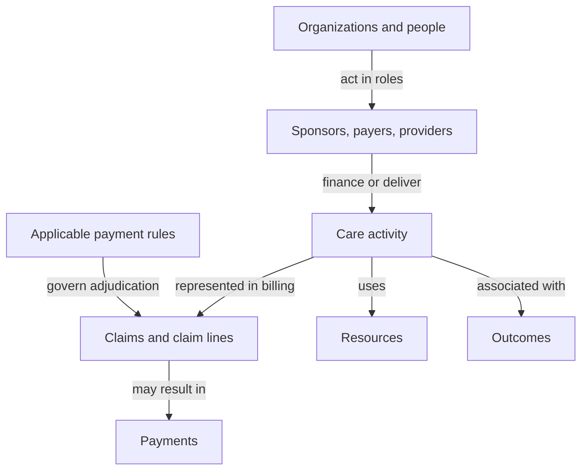

# Understanding the healthcare model

Start here before extending payment coverage or estimating economic distortions.
This guide connects the existing [national ledger](../ontology.md) and
[payment rulebook](../rulebook/ontology.md). It does not introduce a new source
of expenditure data or an economic scoring model.

## Four questions, four kinds of evidence

| Layer | Question | Current evidence | What remains to be established |
|---|---|---|---|
| Accounting | How much spending is reported, through which financing categories, for which broad services? | CMS NHEA observations and reconciliation | Links to particular care events and providers |
| Payment institutions | What does a specified payment mechanism prescribe for a given context? | Effective rules, parameters, assignments, and partial payment traces | Complete adjudication and observed payments |
| Production and outcomes | What resources were used, what care was delivered, and what resulted? | Not implemented | Comparable populations, costs, utilization, and outcomes |
| Economic evaluation | What alternative would improve allocation, and for whom? | Not implemented | Counterfactual, identification strategy, uncertainty, and distributional effects |

The layers answer different questions about overlapping activity. A correctly
reproduced payment formula establishes a rule-based benchmark. A claim that the
benchmark is efficient needs additional evidence and an explicit objective.

## Suggested learning order

1. Read the accounting and actor terms in [concepts](concepts.md). Follow a
   premium and a provider payment through different accounting views. Explain
   why these are not automatically additive spending observations.
2. Read the first two [worked examples](worked_examples.md): one national cell
   and the facility/nonfacility professional-fee comparison. Identify the unit
   of observation before interpreting either number.
3. Read the outpatient packaging and inpatient date examples. Explain why one
   code does not imply one independent payment, and why an IPPS date means
   discharge date.
4. Read [modeling decisions](decisions.md). Distinguish what is implemented from
   proposals for later economic analysis.
5. Use the [data connection inventory](data_connections.md) to select one
   feasible bridge from payment rules to observed activity.

The examples are generated from committed ledger and trace files. After
installing the locked environment with `uv sync --locked --dev`, regenerate
them without downloading CMS archives:

```bash
make ontology-guide
```

`make reproduce` also regenerates them after rebuilding the payment traces.

## Relationships and boundaries

This is a conceptual map, not a claim that all these joins are implemented:



The outcome relationship is descriptive; a causal effect needs a study design.
The national ledger is a separate aggregate accounting view. Relating it to
this map requires reconciliation of populations, time periods, non-claim
revenues, and classification boundaries. It is not a sum of the example traces.

| Relationship | Cardinality or boundary to preserve |
|---|---|
| Organization → role | One organization can have multiple roles; a role is not an identity. |
| Care activity → billing records | An encounter may produce several bills; an episode may span encounters. No one-to-one mapping is assumed. |
| Codes → payment | Claim context can package multiple services or split professional and facility components. |
| Rule → version | The same policy concept can have multiple effective versions. A count of versioned rules is not a count of independent economic mechanisms. |
| Rule/parameter/assignment → sources | Many-to-many, with explicit numeric, correction, and other source roles. |
| Provider → identifier | An identifier belongs to a specified identification system; a crosswalk is evidence to obtain, not an assumed equality. |

## A question contract before analysis

For each proposed comparison, write down:

- the target population and observation unit;
- the amount meaning and perspective: rate, liability, payment, or cost;
- service/discharge dates, reporting period, and release used;
- which sources are observed or published, calculated, or estimated;
- required links, their cardinalities, and unmatched records;
- what can be concluded, and what evidence would overturn the interpretation.

For example, comparing professional base fees across settings is already
possible. Comparing total encounter spending needs the corresponding facility
and other payments. Estimating savings while preserving care requires still
more evidence about service comparability, patient needs, outcomes, and behavior.

The introductory CMS reading is its two-page
[NHEA category definitions](https://www.cms.gov/files/document/quick-definitions-national-health-expenditures-accounts-nhea-categories.pdf).
The full [NHEA methodology](https://www.cms.gov/files/document/definitions-sources-methods.pdf)
is the accounting authority. Repository-specific boundaries are documented in
[Stage 1](../ontology.md) and [Stage 2A](../rulebook/scope.md).
